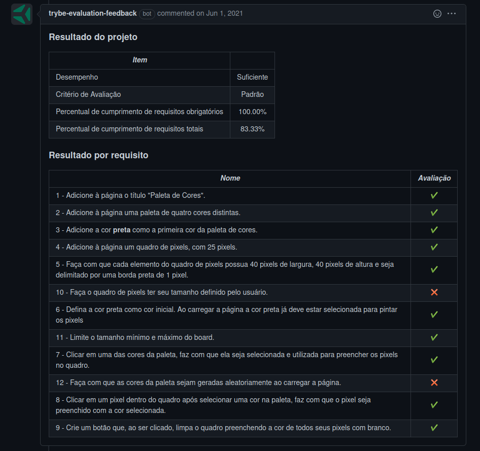

# Welcome to the Recipe APP

## Context

This project was made as a work assignment in during the Trybe web developer course.

The goal was to create a pixel art palette, where you could fill the pixels with the colors you choose. It was one of the early projects, and I really enjoyed making it.

---

## How to install

Copy the ssh from the project `https://github.com/luciobj/Project-Pixel-Art`

* Open a terminal int your machine and type the following commands in ordedr:

  * `git clone https://github.com/luciobj/Project-Pixel-Art`
  * `cd Project-Recipes-App`

  From here you can open the html file with your editor of choice, and/or run a server to see the end result. I recommend using VSCode, and using the Live Server extension for such.

---

### Tecnologys

This project was developed using HTML and DOM features, and a little bit of CSS styling.

---

## Evaluator Results

This is a screenshot of the last run of the Trybe evaluator, which scores the demands of the project.

<!-- Este README foi inspirado por [Paulo](https://github.com/pauloricardoz)